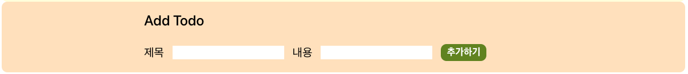
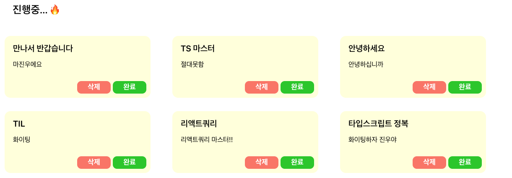
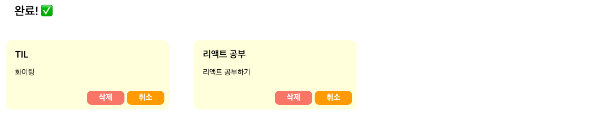

# React To Do Web App
<!-- > Outline a brief description of your project. -->
<!-- > Live demo [_here_](https://www.example.com). -->

## Table of Contents

* [Technologies](#technologies)
* [Modules](#Modules)
* [Components](#Components)

## Technologies 
&nbsp;&nbsp;

## Modules

- axios/todos.ts
  - 서버 통신과 관련된 로직을 수행하는 모듈 (fetchTodos, addTodo, deleteTodo, switchTodo)

- query/useTodoQuery.ts
  - useQuery로 서버로부터 todos를 가져와 data:todos로 return
  - addTodoMutation: addTodo 함수를 mutationFn으로 받아 addTodoMutation을 반환
  - deleteTodoMutation: deleteTodo 함수를 mutationFn으로 받아 deleteTodoMutation 반환
  - switchTodoMutation: switchTodo 함수를 mutationFn으로 받아 switchTodoMutation 반환
 
- hooks/useTodos.ts
  - useTodoQuery.ts로부터 받은 mutation을 실행하는 모듈
  - donelist와 todolist를 데이터의 isDone 형태에 따라 분리

## Components

- Input

- TodosList (미완료된 목록)

- TodosList (완료된 목록)

- common/Button.tsx
버튼의 type, 버튼에 들어갈 text, color, eventHandler 함수를 받아 button 태그를 반환
